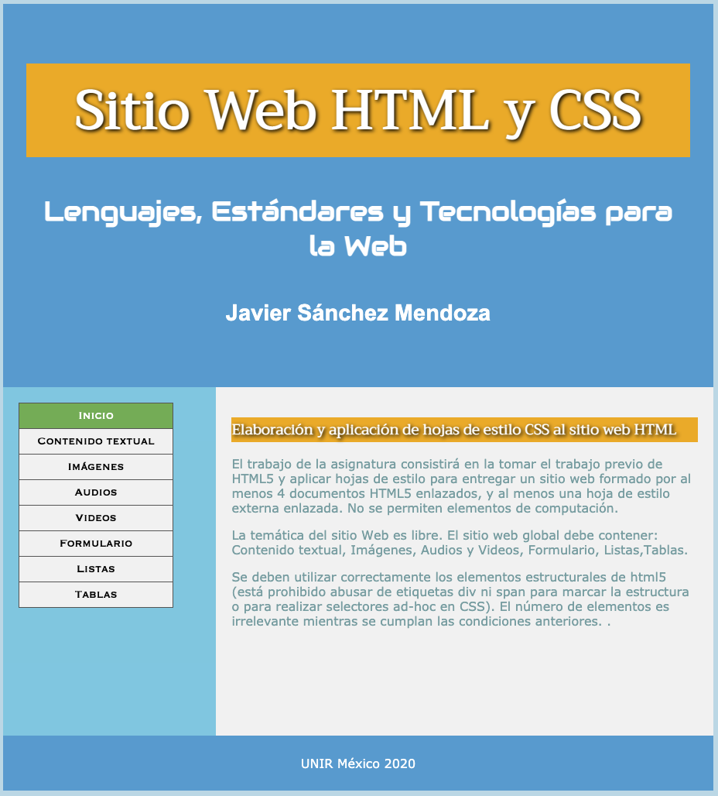

# Sitio Web HTML y CSS

## Bienvenido! 👋

El trabajo de la asignatura consistirá en la tomar el trabajo previo de HTML5 y aplicar hojas de estilo para entregar un sitio web formado por al menos 4 documentos HTML5 enlazados, y al menos una hoja de estilo externa enlazada. No se permiten elementos de computación.

La temática del sitio Web es libre. El sitio web global debe contener: Contenido textual, Imágenes, Audios y Videos, Formulario, Listas,Tablas.

Se deben utilizar correctamente los elementos estructurales de html5 (está prohibido abusar de etiquetas div ni span para marcar la estructura o para realizar selectores ad-hoc en CSS). El número de elementos es irrelevante mientras se cumplan las condiciones anteriores.